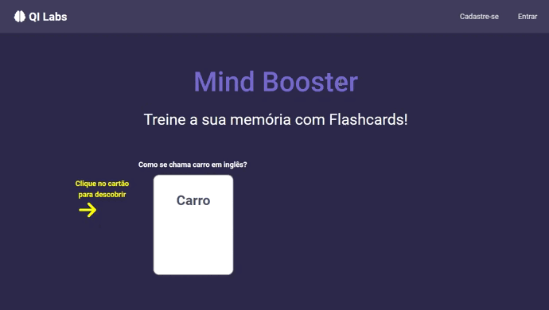

<h1 align="center">Mind Booster</h1>

  

## :pushpin: Tabela de conteúdo
<!--ts-->
   * [Descrição do projeto](#memo-descrição-do-projeto)
   * [Funcionalidades do projeto](#white_check_mark-funcionalidades-do-projeto)
   * [Executar a aplicação](#hammer_and_wrench-executar-a-aplicação)
   * [Tecnologias utilizadas](#hash-tecnologias-utilizadas)
   * [Autor](#man_technologist-autor)
<!--te-->

## :memo: Descrição do projeto

O Mind booster possibilita a criação de flashcards para ajudar na memorização e aprendizagem.

🧠📚

  

## :white_check_mark: Funcionalidades do projeto

- [x] Cadastro de usuário
- [x] Autenticação de usuário
- [x] Criação/edição/exclusão de coleções de flashcards
- [x] Criação/edição/exclusão de flashcards
- [x] Busca de flashcards
- [x] Jogar

## :hammer_and_wrench: Executar a aplicação

    # Acesse a pasta do projeto baixado no terminal/cmd
    $ cd flashcards

    # Instale as dependências
    $ npm install

    # Execute a aplicação
    $ npm run dev

## :hash: Tecnologias utilizadas

- [Node.js](https://nodejs.org/en/)
- [Bootstrap](https://getbootstrap.com/)
- [Vite + React](https://vitejs.dev/)
- [Redux Toolkit](https://redux-toolkit.js.org/)
- [React Redux](https://react-redux.js.org/)
- [Google Firebase](https://firebase.google.com/)
- [UUID](https://www.npmjs.com/package/uuid)
- [Redux Persist](https://github.com/rt2zz/redux-persist)

## :man_technologist: Autor

| [ Matheus Henrique Ferreira](https://github.com/matheushenriqueferreira) |  
| :---: |
